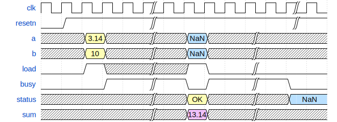

# Сумматор чисел с плавающей точкой
- [Сумматор чисел с плавающей точкой](#сумматор-чисел-с-плавающей-точкой)
  - [Основная идея](#основная-идея)
    - [Реализация аккумулятора. Идея](#реализация-аккумулятора-идея)
    - [Расчет тактов для получения валидного результата](#расчет-тактов-для-получения-валидного-результата)
  - [Струкутра директории](#струкутра-директории)
  - [Сумматор](#сумматор)
    - [Порты модуля сумматора](#порты-модуля-сумматора)
    - [Порядок работы с модулем](#порядок-работы-с-модулем)
    - [Временные диаграммы работы сумматора](#временные-диаграммы-работы-сумматора)
  - [Аккумулятор](#аккумулятор)
    - [Порты модуля сумматора](#порты-модуля-сумматора-1)
    - [Порядок работы с модулем](#порядок-работы-с-модулем-1)
    - [Временные диаграммы работы аккумулятора](#временные-диаграммы-работы-аккумулятора)
  - [Проведение симуляции](#проведение-симуляции)
  - [Используемая библиотека](#используемая-библиотека)
    - [User Guide к используемой библиотеке](#user-guide-к-используемой-библиотеке)

## Основная идея

Найти библиотеку, реализующую суммирование двух чисел в формате floating point одинарной точности. Реализовать обертку, при необходимости добавить некоторые сигналы. 

### Реализация аккумулятора. Идея
В качестве системы, которая сможет преобразовать N чисел в одно число, которое является суммой ряда этих чисел, можно выставить сумматор с накоплением. Он же **аккумулятор**. Т.к. необходимо создать устройство с минимальной утилизацией по ресурсам, то можно переиспользовать изначальный сумматор, но при этом убрать 
один вход для числа из входных портов. Внутри создаваемого модуля объявить дополнительный сигнал, который будет соединять выход сумматора и вход для одного из портов для числа. То есть завести его выход на вход. С учетом этого получится суммирование всех предыдущих отсчетов с текущим валидным. Таким образом можно решить поставленную задачу с минимальной утилизацией.

### Расчет тактов для получения валидного результата
Но при всем этом возникает задержка на время обработки модулем принятых данных. Количество тактов, которое необходимо для расчета суммы ряда из числа N рассчитывается исходя из формулы ниже:

```
Cycles = N*lat
```

Где ```lat``` - в данном случае задержка в тактах между валидными входными данными и результатом на выходе. Для этого модуля она равна **12 тактам**


## Струкутра директории
```
floating_point_adder
│ └─── docs               -- файлы документации
│ │    └─── images        -- картинки для README
│ │    └─── wavedrom      -- Исходники временных диаграмм в JSON 
│ └─── sim                -- Директория с файлами симуляции
│ │    └─── fp_accum_sim  -- файлы симуляции для аккумулятора
│ │    └─── fp_adder_sim  -- файлы симуляции для сумматора
│ └─── src                -- исходники
│ │    └─── lib           -- библиотека с функциями для floating point
```


## Сумматор
### Порты модуля сумматора
Top-level для сумматора является модуль ```floating_point_adder.sv```


| Имя порта | Направление | Тип    | Описание                                                                          |
| --------- | ----------- | ------ | --------------------------------------------------------------------------------- |
| clk       | input       |        | Тактовый сигнал                                                                   |
| resetn    | input       |        | Сигнал сброса. <span style="color:red">Акт. уровень 0</span>                      |  
| a         | input       | [31:0] | Первое число для сложения                                                         |
| b         | input       | [31:0] | Второе число для сложения                                                         |
| load      | input       |        | Строб загрузки чисел а и b                                                        |
| busy      | output      |        | Выс. уровень означает провередение вычислений, низкий - готовность принять данные |
| status    | output      |        | Статус выхода. 2 -NaN,  1 - Бесконечность, Bit 0 - OK.                            |
| sum       | output      | [31:0] | резульат суммы                                                                    |

### Порядок работы с модулем
1. Сигнал сброса имеет <span style="color:red">активный уровень 0</span>. Сброссить модуль, установив resetn в активный уровень
2. Выставить два числа в порты ```a``` и ```b```
3. Выставить сигнал ```load``` в 1. Дождаться когда сигнал ```busy``` станет равным 1. После этого данные перейдут в обработку
4. Валидные данные забрать на выходе при ```~busy```


### Временные диаграммы работы сумматора
Временные диаграммы работы сумматора показана ниже



## Аккумулятор
### Порты модуля сумматора
Top-level для аккумулятор является модуль ```floating_point_accum.sv```


| Имя порта | Направление | Тип    | Описание                                                                          |
| --------- | ----------- | ------ | --------------------------------------------------------------------------------- |
| clk       | input       |        | Тактовый сигнал                                                                   |
| resetn    | input       |        | Сигнал сброса. <span style="color:red">Акт. уровень 0</span>                      |  
| a         | input       | [31:0] | Первое число для сложения                                                         |
| load      | input       |        | Строб загрузки чисел а и b                                                        |
| busy      | output      |        | Выс. уровень означает провередение вычислений, низкий - готовность принять данные |
| status    | output      |        | Статус выхода. 2 -NaN,  1 - Бесконечность, Bit 0 - OK.                            |
| sum       | output      | [31:0] | резульат суммы                                                                    |

Отличие от сумматора в том, что **отсутсвует входной сигнал b**


### Порядок работы с модулем
1. Сигнал сброса имеет <span style="color:red">активный уровень 0</span>. Сброссить модуль, установив resetn в активный уровень
2. Выставить число на порт ```a```
3. Выставить сигнал ```load``` в 1. Дождаться когда сигнал ```busy``` станет равным 1. После этого данные перейдут в обработку
4. Валидные данные забрать на выходе при ```~busy```
5. Повторить с п.2 Для N чисел N раз
6. При подаче новой последоваетельности еобходимо сбросить модуль. п.1


### Временные диаграммы работы аккумулятора
Временные диаграммы работы аккумулятора с накоплением показана ниже


## Проведение симуляции

Файлы для симуляции представлены в папке ```sim``` для двух модулей. Для каждой симуляции запуск одинаков, за исключением папок

Для проведения симуляции выполнить: 


Перейти в папку симуляции

* Для сумматора
    ```
    cd sim/fp_adder_sim
    ```

* Для аккумулятора
    ```
    cd sim/fp_accum_sim
    ```

Выполнить 
```
make sim
```
После этого запустится ModelSim с временными диаграммами. 

Чтобы отчистить директорию от файлов симуляции выполнить 
```
make clean
```


## Используемая библиотека
Библиотека найдена на [pulselogic.com](http://www.pulselogic.com.pl/en/float.html), в которой присутсвует несколько модулей, которые реализуют те или иные функции. Для заданной работы используется модуль ```Float32Add.v```.

### User Guide к используемой библиотеке
Находится в папке ```docs``` [Float32Lib_User_Guide](docs/Float32Lib_User_Guide.pdf) и представляется вместе с библиотекой.
http://www.pulselogic.com.pl/files/Float32Lib_User_Guide.pdf


